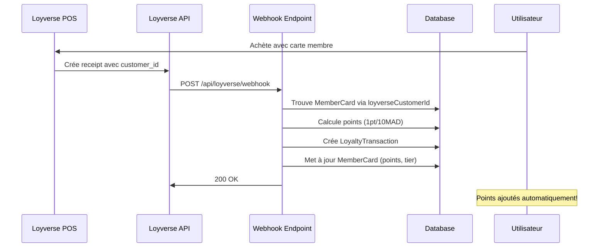

# Configuration des Webhooks Loyverse

Ce guide explique comment configurer les webhooks Loyverse pour synchroniser automatiquement les achats avec le système de fidélité Kech Waffles.

## 📋 Prérequis

1. ✅ Avoir connecté l'application OAuth Loyverse (`/api/loyverse/connect`)
2. ✅ Avoir un token OAuth valide stocké en base de données
3. ✅ Application déployée en production avec HTTPS

## 🔧 Configuration Étape par Étape

### Étape 1: Connecter OAuth (À faire une seule fois)

Visitez l'URL suivante pour initier la connexion OAuth:

```
https://kechwaffles.com/api/loyverse/connect
```

Vous serez redirigé vers Loyverse pour autoriser l'application. Après autorisation, le token sera automatiquement stocké en base de données.

### Étape 2: Enregistrer les Webhooks (À faire une seule fois)

Une fois OAuth connecté, enregistrez les webhooks en envoyant une requête POST:

```bash
curl -X POST https://kechwaffles.com/api/loyverse/setup-webhook
```

Ou visitez simplement l'URL dans votre navigateur (en tant qu'admin).

Cette requête va:
- Créer un webhook pour l'événement `receipt.created`
- Créer un webhook pour l'événement `receipt.updated`
- Configurer l'URL cible: `https://kechwaffles.com/api/loyverse/webhook`

### Étape 3: Vérifier les Webhooks Enregistrés

Pour voir la liste des webhooks configurés:

```bash
curl https://kechwaffles.com/api/loyverse/setup-webhook
```

## 🔐 Sécurité: Validation des Signatures

### Configuration du Secret (Optionnel mais Recommandé)

Pour valider que les webhooks proviennent bien de Loyverse, ajoutez un secret dans `.env`:

```bash
LOYVERSE_WEBHOOK_SECRET="votre_secret_aleatoire_tres_long"
```

Générer un secret sécurisé:

```bash
node -e "console.log(require('crypto').randomBytes(32).toString('hex'))"
```

### Comment Loyverse Signe les Webhooks

Loyverse envoie un header `X-Loyverse-Webhook-Signature` avec chaque webhook. Notre endpoint vérifie cette signature:

```typescript
const signature = request.headers.get("X-Loyverse-Webhook-Signature");
const expectedSignature = crypto
  .createHmac("sha256", process.env.LOYVERSE_WEBHOOK_SECRET)
  .update(rawBody)
  .digest("hex");

if (signature !== expectedSignature) {
  return NextResponse.json({ error: "Invalid signature" }, { status: 401 });
}
```

## 📡 Événements Webhook Disponibles

### `receipt.created` - Nouvelle Vente

Envoyé quand un nouveau reçu/vente est créé dans Loyverse.

**Payload exemple:**

```json
{
  "event_type": "receipt.created",
  "data": {
    "id": "receipt_12345",
    "receipt_number": "000123",
    "customer_id": "customer_abc",
    "total_money": "150.00",
    "receipt_date": "2025-01-15T10:30:00Z",
    "line_items": [
      {
        "name": "Gaufre Tiramisu",
        "price": "75.00",
        "quantity": 2
      }
    ]
  }
}
```

**Traitement automatique:**
1. Trouve la carte membre liée au `customer_id` Loyverse
2. Calcule les points (1 point / 10 MAD)
3. Met à jour la carte membre (points, montant dépensé, nombre de visites)
4. Recalcule le tier (BRONZE → SILVER → GOLD → PLATINUM)
5. Crée une transaction de fidélité

### `receipt.updated` - Vente Modifiée

Envoyé quand un reçu existant est modifié (remboursement, correction, etc.).

**Traitement:** Même logique que `receipt.created`.

### `receipt.deleted` - Vente Supprimée / Remboursement

Envoyé quand un reçu est supprimé (remboursement).

**Payload exemple:**

```json
{
  "event_type": "receipt.deleted",
  "data": {
    "id": "receipt_12345",
    "customer_id": "customer_abc"
  }
}
```

**Traitement automatique:**
1. Trouve la transaction de fidélité originale associée au reçu
2. Crée une transaction d'ajustement avec points négatifs
3. Retire les points du total et des points actuels
4. Retire le montant du total dépensé
5. Décrémente le nombre de visites
6. Recalcule le tier (peut descendre si le montant total change)
7. Enregistre une transaction `MANUAL_ADJUSTMENT` pour tracer le remboursement

**Note:** Les points et montants ne peuvent pas descendre en dessous de 0 (protection avec `Math.max(0, ...)`)

## 🔄 Flux de Synchronisation Automatique



## 🧪 Test du Webhook

### Test Manuel avec cURL

**Test d'achat:**

```bash
curl -X POST https://kechwaffles.com/api/loyverse/webhook \
  -H "Content-Type: application/json" \
  -d '{
    "event_type": "receipt.created",
    "data": {
      "id": "test_receipt_123",
      "customer_id": "YOUR_LOYVERSE_CUSTOMER_ID",
      "total_money": "100.00",
      "receipt_date": "2025-01-15T10:00:00Z"
    }
  }'
```

**Test de remboursement:**

```bash
curl -X POST https://kechwaffles.com/api/loyverse/webhook \
  -H "Content-Type: application/json" \
  -d '{
    "event_type": "receipt.deleted",
    "data": {
      "id": "test_receipt_123",
      "customer_id": "YOUR_LOYVERSE_CUSTOMER_ID"
    }
  }'
```

### Test en Production

1. Créez un client test dans Loyverse avec un `customer_code` correspondant à un numéro de carte (ex: `KW-ABC123`)
2. Faites une vente test sur le POS Loyverse
3. Scannez/entrez le numéro de carte du client
4. Vérifiez les logs:
   ```bash
   # Sur Vercel
   vercel logs
   ```
5. Vérifiez dans la BDD que les points ont été ajoutés:
   ```sql
   SELECT * FROM "LoyaltyTransaction" WHERE "orderId" = 'receipt_id';
   SELECT * FROM "MemberCard" WHERE "loyverseCustomerId" = 'customer_id';
   ```

## 📊 Monitoring et Logs

Les webhooks génèrent des logs détaillés:

**Logs d'achat:**
- `📥 Loyverse webhook received: receipt.created` - Webhook reçu
- `💰 Processing receipt {id} for customer {customerId}` - Traitement en cours
- `✅ {points} points added to {userName}` - Points ajoutés avec succès
- `⚠️  No member card found for Loyverse customer {id}` - Client non trouvé
- `ℹ️  Transaction already processed: {receiptId}` - Transaction déjà traitée (dédoublonnage)
- `❌ Error handling receipt:` - Erreur lors du traitement

**Logs de remboursement:**
- `📥 Loyverse webhook received: receipt.deleted` - Webhook remboursement reçu
- `🔄 Processing receipt deletion {id} for customer {customerId}` - Traitement du remboursement
- `   Removing {points} points and {amount} MAD` - Points et montant à retirer
- `✅ {points} points removed from {userName}` - Points retirés avec succès
- `ℹ️  No transaction found for receipt: {receiptId}` - Aucune transaction à annuler
- `❌ Error handling receipt deletion:` - Erreur lors du remboursement

## ⚙️ Variables d'Environnement

```bash
# OAuth Loyverse
LOYVERSE_CLIENT_ID="JBiSwItgivbz5MNbM65K"
LOYVERSE_CLIENT_SECRET="IBfRrgZoKj3aZFqMnD8v0YYJfOm2v7t6mB80u7-oImonDxJ9u6nRqw=="

# URL de l'application
NEXT_PUBLIC_BASE_URL="https://kechwaffles.com"

# Secret webhook (optionnel mais recommandé)
LOYVERSE_WEBHOOK_SECRET="votre_secret_ici"
```

## 🚨 Dépannage

### Le webhook ne reçoit rien

1. **Vérifier que les webhooks sont enregistrés:**
   ```bash
   curl https://kechwaffles.com/api/loyverse/setup-webhook
   ```

2. **Vérifier l'URL du webhook dans Loyverse:**
   - Doit être: `https://kechwaffles.com/api/loyverse/webhook`
   - Doit être HTTPS (localhost ne fonctionne pas)

3. **Vérifier les logs Vercel:**
   ```bash
   vercel logs --follow
   ```

### Les points ne sont pas ajoutés

1. **Vérifier que le client a un `customer_id` dans le reçu:**
   - Le caissier doit scanner/entrer la carte avant de valider la vente

2. **Vérifier que le `loyverseCustomerId` est lié à la carte membre:**
   ```sql
   SELECT * FROM "MemberCard" WHERE "loyverseCustomerId" = 'customer_id_loyverse';
   ```

3. **Vérifier les logs du webhook:** Rechercher les messages d'erreur

### Signature invalide

- Vérifier que `LOYVERSE_WEBHOOK_SECRET` est identique dans:
  - Votre `.env`
  - Les variables d'environnement Vercel
  - La configuration webhook Loyverse (si applicable)

## 📚 Ressources

- [Documentation Loyverse API](https://developer.loyverse.com/docs/)
- [Guide OAuth Loyverse](./LOYVERSE_OAUTH_SETUP.md)
- [Webhook Best Practices](https://developer.loyverse.com/docs/#webhooks)

## 🎯 Résumé des Endpoints

| Endpoint | Méthode | Description |
|----------|---------|-------------|
| `/api/loyverse/connect` | GET | Initie le flux OAuth |
| `/api/loyverse/callback` | GET | Callback OAuth, stocke le token |
| `/api/loyverse/setup-webhook` | POST | Enregistre les webhooks auprès de Loyverse |
| `/api/loyverse/setup-webhook` | GET | Liste les webhooks configurés |
| `/api/loyverse/webhook` | POST | Reçoit les événements webhook de Loyverse |

## ✅ Checklist de Configuration

- [ ] OAuth connecté (`/api/loyverse/connect`)
- [ ] Token stocké en BDD (vérifier table `LoyverseConfig`)
- [ ] Webhooks enregistrés (`POST /api/loyverse/setup-webhook`)
- [ ] Secret webhook configuré dans `.env` (optionnel)
- [ ] Test avec une vente réelle effectué
- [ ] Monitoring des logs mis en place
- [ ] Documentation partagée avec l'équipe

---

**Dernière mise à jour:** 15 janvier 2025
